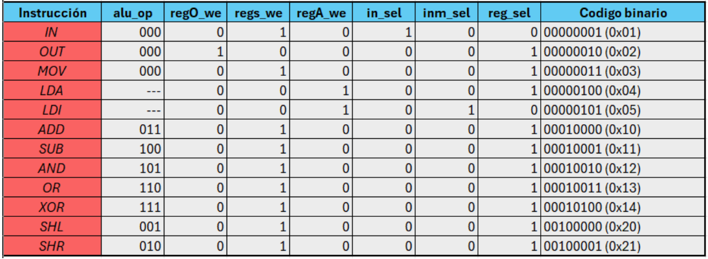
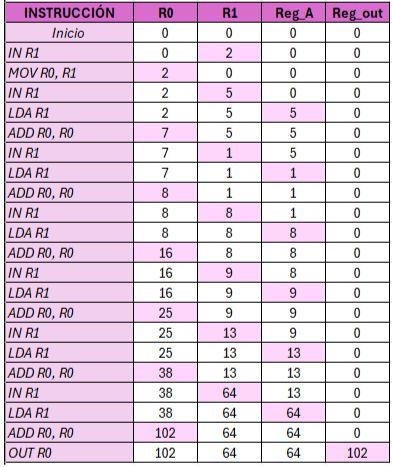

# Diseño Lógico Riccio-Palacios
TP de promoción Diseño Lógico, untref 2025

## Integrantes:

- Riccio Diamela - 76761
- Palacios Laureano - 74301

---

# Resolución de consignas:

### **1) Completar la tabla y minimizar las funciones.**

#### **Tabla completa:**

#### **Minimización de funciones:**

- **RegO_we:**

    ¬x4 . ¬x2 . x1 .¬x0         

- **RegA_we:**

    ¬x4 . x2

- **In_sel = 1 cuando:**

    ¬x5 . ¬x4 . ¬x2 ¬x1 . x0

- **Inm_sel = 1 cuando:**

    x1 . x0

- **Regs_We:**
    
    x5 + x4 + (¬x2 . x0)

- **Reg_sel:**

    x5 + x4 + (x1 + ¬x0)

- **ALU(0):**

    (x5 + x4) . ¬x0

- **ALU(1):**

    (x5 + x4) . (¬x1 . ¬x0 + ¬x2 . x0)

- **ALU(2):**

    (x5 + x4) . (¬x2 . x0 + ¬x2 . x1 . ¬x0 + x2 . ¬x1 . x0)

---

### **2) Implementar Decode en VHDL e indicar especificaciones del circuito.**

La implementación se encuentra en el archivo Decode.vhd dentro de la carpeta Implementaciones_VHDL:  
- [Ir a Decode en VHDL](Implementaciones_VHDL/Decode.vhd)

Ambos circuitos son de caracter combinacional ya que las salidas estan programadas de modo que dependen unicamente de la señal de entrada INSTR.

La arquitectura "decode_Concurrente" corresponde al estilo de modelado; Flujo de Datos. El modo que se asignan las señales y se moveran los datos del procesador depende de operaciones lógicas, especificamente, las que minimizamos en el punto 1 con ayuda de la tabla.  
En cambio en "decode_Secuencial" el estilo descriptivo es algorítmico ya que se utiliza un bloque process con descripciones secuenciales, como el case y asignaciones dentro del proceso. 

---

### **3) Describir en VHDL los componentes PC e IR y mencionar especificaciones de los circuitos.**

Las implementaciones se encuentran en los archivos IR.vhd y PC.vhd dentro de la carpeta Implementaciones_VHDL:  
- [Ir a PC en VHDL](Implementaciones_VHDL/PC.vhd)  
- [Ir a IR en VHDL](Implementaciones_VHDL/IR.vhd)

Los componentes PC e IR son de tipo secuencial porque poseen una señal de clock y una señal de reset síncrono, por ende depende del flanco de reloj.
El estilo descriptivo de los componentes PC e IR es algorítmico porque describe el comportamiento del proceso y no los detalles físicos de la arquitectura o el movimiento de los datos. Utiliza estructuras secuenciales (“if”, “then”) para describir de manera simple el comportamiento dentro del componente dependiendo del estado del circuito y no solo del dato de entrada.

---

### **4) Determinar la frecuencia de reloj óptima para el procesador.**

La frecuencia de operación óptima es de: 31,25 MHZ. 

Justificación:  
    Para calcular la frecuencia óptima de reloj se necesita calcular el tiempo de la operación más larga y luego obtener la frecuencia con el inverso de ese número en segundos (1/T_Max). Por lo general es operación es cualquiera que incluya a la ALU y teniendo en cuenta esto, avanzamos con el cálculo.

Recorrido de una operación de ALU:  

De este modo el tiempo máximo por instrucción sería:
10 + 6 + 5 + 10 + 1 (margen)= 32ns

Y el cálculo de la frecuencia de reloj:
1/(32/1000)= 31,25 MHz

---

### **5) Realizar un programa para efectuar una sumatoria.**

Usaremos al R[0] como acumulador de la suma total.  
El R[1] Almacenará los valores leyendo el INPUT.  
Reg_A  es el 2do operador de la ALU.  
Reg_out  para enviar el resultado final.  

**Paso 1:** Leer el input y como es el 1er número, moverlo directamente al R[0].

- **Sumar 2:**  
IN R1 -> R[1]  = 2  
Mov R0, R1 -> R[0] = 2  

    Llamamos a IN: Reg[rd] = IN -> guarda el input en R[1]   
Ejecutamos MOV: Reg[rd] = Reg[rs] -> movemos el dato de R[1] a [R0]

**Paso 2:** Seguir leyendo el input pero ahora sí, ejecutando la suma.

- **Sumar 5:**  
IN R1 -> R[1] = 5  
LDA R1 -> Reg_A = 5  
ADD R[0], R[0] -> R[0] = R[0] + Reg_a  

    Se lee el input, se envía al Reg_A y se llama a la instrucción ADD cuya descripción era: Reg[rd] = Reg[rs] + Reg_A.   
    De este modo se guarda en R[0] la suma entre R[0] y Reg_A.

- **Sumar 1:**  
    IN R1 -> R[1] = 1  
    LDA R1 -> Reg_A = 1  
    ADD R[0], R[0] -> R[0] = R[0] + Reg_a (7 + 1 = 8)  

- **Sumar 8:**  
    IN R1 -> R[1] = 8  
    LDA R1 -> Reg_A = 8  
    ADD R[0], R[0] -> R[0] = R[0] + Reg_a (8 + 8 = 16)  

- **Sumar 9:**  
 IN R1 -> R[1] = 9  
 LDA R1 -> Reg_A =  9  
 ADD R[0], R[0] -> R[0] = R[0] + Reg_a (16 + 9 = 25)  

- **Sumar 13:**  
 IN R1 -> R[1] = 13  
    LDA R1 -> Reg_A = 13  
    ADD R[0], R[0] -> R[0] = R[0] + Reg_a (25 + 13 = 38)  

- **Sumar 64**  
    IN R1 -> R[1] = 64  
    LDA R1 -> Reg_A = 64  
    ADD R[0], R[0] -> R[0] = R[0] + Reg_a (38 + 64 = 102)  

**Paso 3:** El procesador envía el valor de la suma.

-   OUT R0  

    Se llama a la instrucción OUT de descripción: Reg_out = Reg[rs].  
    De este modo guardaremos el dato de R[0] (nuestra suma) en el registro de salida.

**5a)** Tabla con contenido ROM:
- 

---
